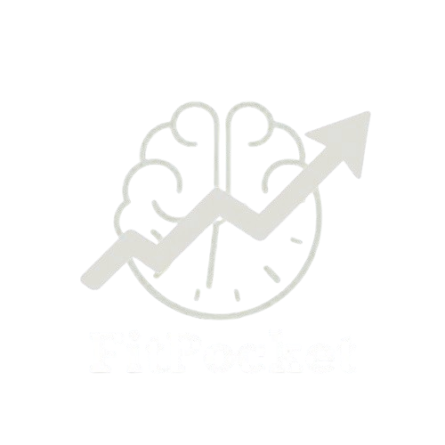

# FitPocket

FitPocket es tu coach/asistente IA personal para que puedas saber cómo empezar en tus primeros días de entrenamiento en un gimnasio. 
Podrás administrar tus rutinas, FitPocket se adapta a ti, y te recomienda las mejores opciones posibles en los días que tengas libres.
Podrás calcular tu IMC, con esto, la IA podrá saber y realizar su tarea de la mejor manera posible.
Preferencias en cuanto a tus rutinas, ya sea que solo te quieras mantener en forma, bajar de peso, o lo que quieras realizar en tu gimnasio, FitPocket te dará la mejor opción según tus preferencias.

## Objetivo 
Nuestro objetivo es ayudar a las personas que no saben como empezar en sus primeros días en el gimnasio, asistiendole con una IA que hará sus rutinas y, con el seguimiento, podrá notar buenos resultados gracias a FItPocket.

## Documentación
FitPocket es una herramienta para poco conocedores sobre armar rutinas, si quieres saber más sobre nuestro proyecto, entra aquí para saber más. [here](https://github.com/Sofipow-007/FitPocket/blob/main/FitPocket/Documentaci%C3%B3n/Documentaci%C3%B3n%20FitPocket.pdf)
